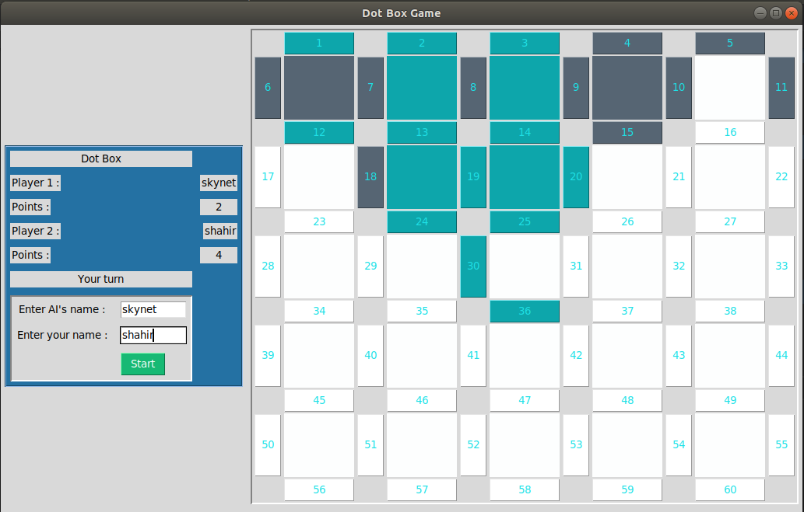

# Dot Box Game using alpha beta pruning algorithm of Adversarial-Searching 
1. I used Alpha beta pruning in this game.

2. It is the famous dot box game where player selects a side of a box each turn and the last one to complete a box by choosing the 
last side gets one point. 

3. One of the two player is human who will play againt the Artificial Intelligence which is designed based on Alpha Beta Minmax algorithm. 

4. User will have to enter his/her name and the AI's name and press start. 

5. It is a board of 5 X 5 boxes. 

6. Human and AI will give a move in each turn. Except when one fills a box, player will move again. 

7. The Human Player is the max player here. The first one to make a move. 
8. Written in #Python and GUI is made by the python library #tkinter 

# Minimax algorithm : 
1. If I try out every possible combinations of the bar selection it will take forever to finish. Since 60 bars so the depth will be 60 and branch at each level except leaf node is almost 60. So 60 to the power 60. So it's not possible to make a move in such time. 
2. So I took an approach and that is developed pickMinBar and pickMaxBar function which will be called at min and max layer each time and the pickMinBar will return a bar which is favorable for min layer and pickMaxBar will pick a bar which is favorable for max layer. 
3. pickMaxBar will try to pick a bar which will let maximizer earn a point or in other word complete a bar. 
4. If pickMaxBar can't find such bar it will then try to pick a bar which will not help min layer. So it will pick a bar from a box where the box has only 1 or 0 clicked bars. So that min can't get a bar which will complete a box in the next turn. 
5. If pickMaxBar can't even find such bars, it will randomly choose an unclicked bar and return. Now here where I should use some famous strategies like Wilson or Yahoo strategies in Dot complete game. I haven't used any yet. But working on it. 
6. pickMinBar will also try to do the same. It will try to pick a bar which is favorable for min layer the same ways pickMaxBar will pick. 
7. By alternatively picking such bars in max and min layer when it will reach leaf node the evaluation fucntion will return a score value of the maximizer. 10 if the number of completed box by maximizer is more than minimizer, -10 if less. Since the board of 5X5 box so there is no scope of getting a draw. If the box had 4X4, the evaluation function would have returned 0.   

# Instructions :
1. download or clone the project. 
2. cd Adversarial_Search.
3. type 'python3 alpha_beta.py' on the command line.

# Issues : 
1. Sometimes the game will hang. Because it's 5X5 board and the minmax algorithm takes 5 seconds maximum to calculate the optimal value. You can wait or you can just type 'ctrl z' on the command line and quit the program. 
2. If you run the code from vscode, the window won't dissapear after pressing 'ctrl z'. In that case you need to close the vscode program and then the game window will close. Otherwise it will freeze. 
3. If you face any issues let me know. 
