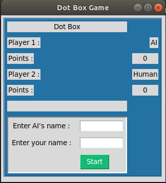
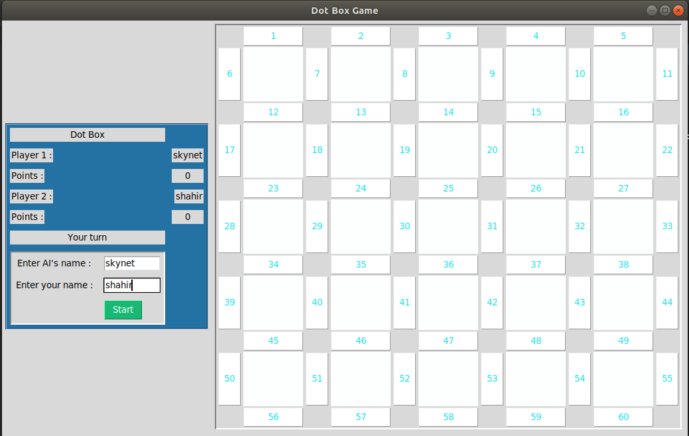

# Adversarial-Search
1. I used Alpha beta pruning in this game.

2. It is the famous dot box game where player selects a side of a box each turn and the last one to complete a box by choosing the 
last side gets one point. 

3. One of the two player is human who will play againt the Artificial Intelligence which is designed based on Alpha Beta Minmax algorithm. 

4. User will have to enter his/her name and the AI's name and press start. 

5. It is a board of 5 X 5 boxes. 

6. Human and AI will give a move in each turn. Except when one fills a box, player will move again. 

7. The Human Player is the max player here. The first one to make a move. 
8. Written in #Python and GUI is made by the python library #tkinter 

# Instructions :
1. download or clone the project. 
2. cd Adversarial_Search.
3. type 'python3 alpha_beta.py' on the command line.

# Issues : 
1. Sometimes the game will hang. Because it's 5X5 board the minmax algorithm takes 5 mins maximum to calculate the optimal value. You can wait or you can just type 'ctrl z' on the command line and quit the progrma. 
2. If you run the code from vscode, the window won't dissapear after pressing 'ctrl z'. In that case you need to close the vscode program and then the game window will close. Otherwise it will freeze. 
3. If you face any issues let me know. 